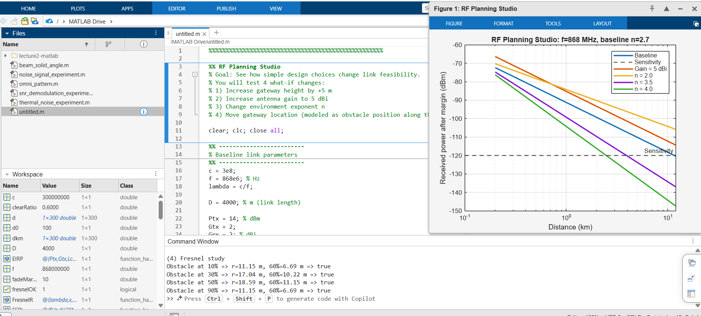

# RF Planning Studio Wireless Link Evaluation

## Plot

## 1. Increase Gateway Height by +5 m

Increasing the gateway height from 20 m to 25 m increases the maximum line of sight distance from approximately 21.0 km to 22.9 km. However, the improvement in link feasibility is small in this model because antenna height mainly affects geometry and line of sight conditions, not the path loss calculation used in the script.

## 2. Increase Antenna Gain to 5 dBi

When both transmitter and receiver antenna gains are increased from 2 dBi to 5 dBi, the received power curve shifts upward by approximately 6 dB. This improves the link budget and extends the coverage range significantly. The maximum achievable distance increases because more energy is effectively transmitted and received in the desired direction.

## 3. Change Environment Exponent

The environment exponent has a strong impact on coverage. When n = 2.0, the signal decays slowly and the coverage range becomes much larger. When n = 3.5, the received power drops faster and the link becomes close to the sensitivity limit at 4 km. When n = 4.0, the signal decays very quickly and the link becomes infeasible at 4 km.

This shows that increasing the environment exponent reduces coverage significantly.

## 4. Move Gateway Location (Fresnel Study)

The Fresnel radius is largest at the midpoint of the link. This is why the center of the path is the most critical location for obstacle clearance. When the obstacle is closer to the transmitter or receiver, the Fresnel radius becomes smaller.

If the 60 percent Fresnel clearance rule is violated, diffraction loss increases and the received signal becomes weaker. This can reduce link reliability or even make the link fail.

## Final Conclusion

In practical wireless deployment, the environment has the strongest impact on coverage. The environment exponent determines how quickly the signal power decreases with distance. Antenna gain improves coverage by increasing the link budget, and antenna height helps improve line of sight and clearance. However, environmental factors such as buildings, trees, and obstacles can reduce coverage more than hardware improvements can compensate. Therefore, understanding and modeling the environment is the most important factor in RF planning.
