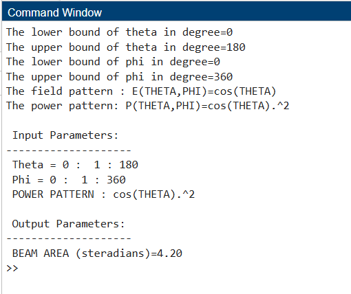
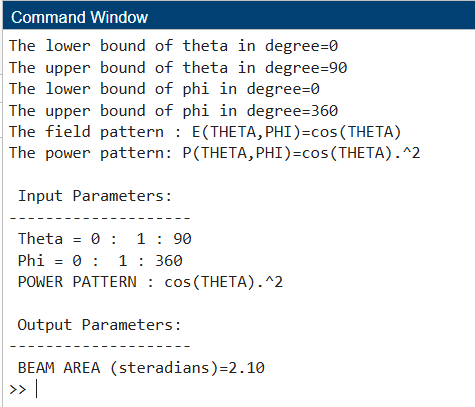

# Beam Solid Angle of an Antenna using MATLAB

## Objective

The objective of this task is to compute the beam solid angle of an antenna using its radiation pattern. The calculation is performed using spherical coordinates and numerical integration in MATLAB.

## Method

The beam solid angle is calculated using the following idea:

* The field pattern is defined as:
  E(THETA, PHI) = cos(THETA)

* The power pattern is:
  P(THETA, PHI) = cos(THETA).^2

* The total radiated power (beam area) is computed using numerical integration over theta and phi.

## Case 1: Full Sphere (Theta = 0 to 180 degrees)

Input:

* Theta range: 0 to 180
* Phi range: 0 to 360
* Field pattern: cos(THETA)
* Power pattern: cos(THETA).^2

Result:
Beam Area = 4.20 steradians

Screenshot:

## Case 2: Half Sphere (Theta = 0 to 90 degrees)

Input:

* Theta range: 0 to 90
* Phi range: 0 to 360
* Field pattern: cos(THETA)
* Power pattern: cos(THETA).^2

Result:
Beam Area = 2.10 steradians

Screenshot:

## Conclusion

The beam solid angle depends on the angular region over which the radiation pattern is integrated. When the full sphere is considered, the beam area is larger. When the integration is limited to half the sphere, the beam area is reduced. This confirms that limiting the angular range reduces the total radiated power. The numerical results match the expected theoretical values.
