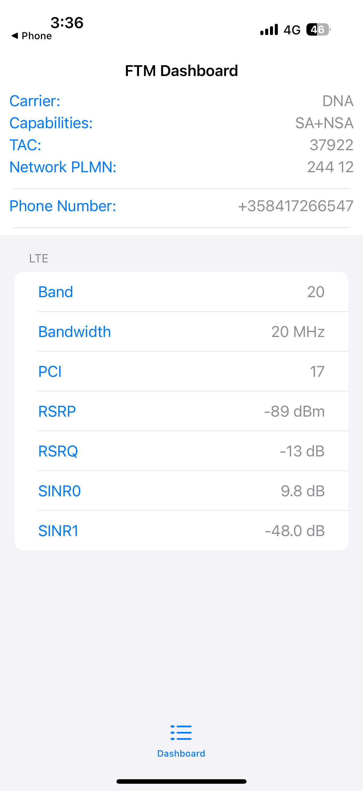
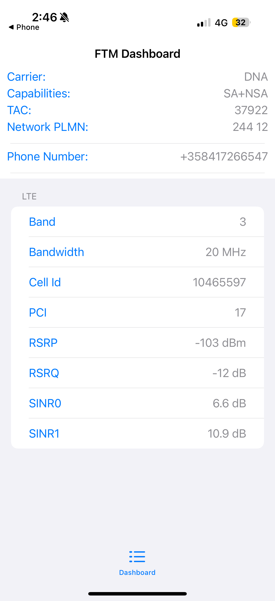
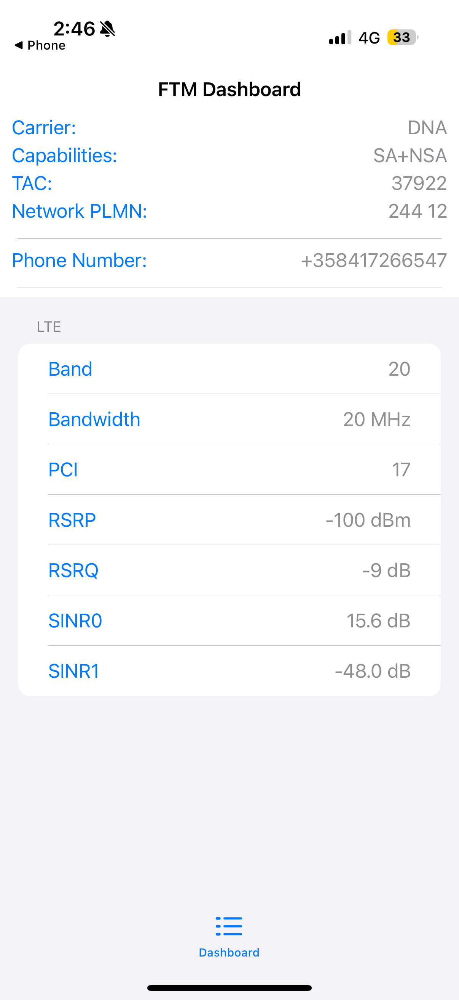

# Cellular Network Analysis using Smartphone Service Mode

## Objective

The objective of this experiment is to analyze cellular network performance using smartphone service mode by observing key parameters under different environmental conditions.

## Tools Used

* Smartphone (Service Mode - FTM Dashboard)
* 4G LTE network (DNA operator)

## Parameters Observed

The following parameters were recorded:

* RSRP (Signal Strength)
* RSRQ (Signal Quality)
* SINR (Signal to Interference + Noise Ratio)
* Band and Bandwidth
* Cell ID / PCI

## Test Locations

Measurements were collected in three different environments:

* Indoor (at home)
* Outdoor (below home)
* University campus

## Measurement Data

| Location             | Band | Bandwidth | RSRP (dBm) | RSRQ (dB) | SINR (dB) |
| -------------------- | ---- | --------- | ---------- | --------- | --------- |
| Indoor (Home)        | 20   | 20 MHz    | -100       | -9        | 15.6      |
| Outdoor (Below Home) | 3    | 20 MHz    | -103       | -12       | 6.6       |
| University           | 20   | 20 MHz    | -89        | -13       | 9.8       |

## Screenshots

### Indoor (Home)

### Outdoor (Below Home)

### University

## Observations

* The strongest signal strength was recorded at the university (-89 dBm).
* Indoor conditions show moderate signal strength and better SINR due to reduced interference.
* Outdoor measurement near home shows weaker signal quality and lower SINR.

## Analysis

* Higher RSRP improves connectivity range and signal availability.
* Higher SINR improves data speed and network performance.
* Lower RSRQ indicates more interference and network congestion.
* Environmental factors such as walls and building materials reduce signal strength.

## Conclusion

The experiment demonstrates that location significantly affects cellular network performance. Indoor and outdoor environments behave differently due to obstacles and interference. Signal strength alone is not enough; signal quality (SINR and RSRQ) plays a critical role in determining data speed and network reliability.
