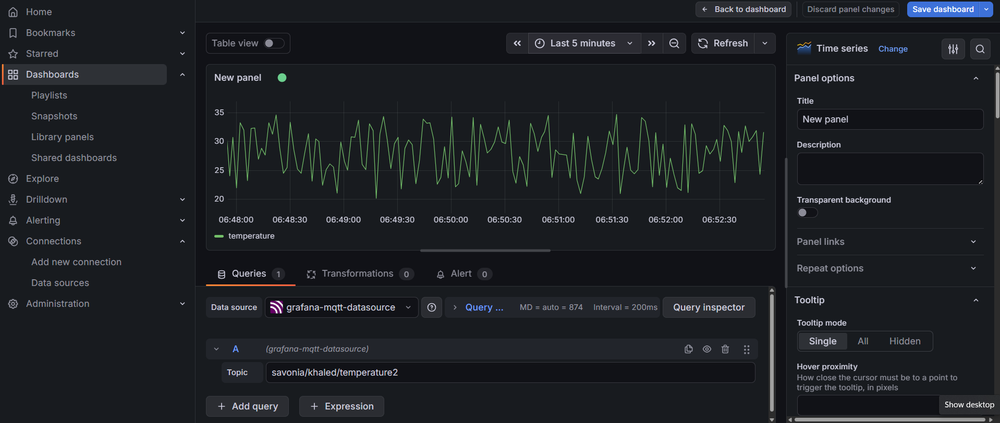

IoT Temperature Monitoring System using MQTT and Grafana

System Description
This project demonstrates a simple IoT monitoring system where a Python script simulates a temperature sensor and publishes data using MQTT. The data is visualized in real time using Grafana. The system works by sending temperature readings from the Python publisher to an MQTT broker, and then Grafana subscribes to the same topic to display the data.

System Pipeline
Python Publisher to MQTT Broker to Grafana Dashboard

MQTT Topic Used
savonia/khaled/temperature2

Broker Used
broker.emqx.io on port 1883

Grafana Dashboard Screenshot

Panel Explanation
The Grafana panel shows real time temperature data received from the MQTT broker. Each value represents a temperature reading sent every two seconds. The horizontal axis represents time, and the vertical axis represents temperature in degrees Celsius. The graph updates continuously as new data arrives.

Limitation of Live Only MQTT Visualization
This system uses MQTT for live data streaming only. Grafana does not store historical data when connected directly to MQTT. If the dashboard is refreshed or reopened, previous data is lost. Only the data received while the dashboard is open is displayed. To store historical data, additional tools such as InfluxDB and Telegraf are required.

Reflection Questions

What is the role of Grafana in this system
Grafana is used as a visualization tool. It connects to the MQTT broker, subscribes to the topic, and displays incoming data in real time using graphs and dashboards.

Why is MQTT useful for monitoring applications
MQTT is useful because it is lightweight and fast. It uses a publish and subscribe model, which allows efficient real time communication between devices. It is ideal for IoT systems and works well even with low bandwidth networks.

What is the difference between live monitoring and historical storage
Live monitoring shows data in real time without saving it, while historical storage saves data in a database for future analysis. Live monitoring is simple and immediate, but historical storage allows reviewing past data, generating reports, and performing analysis over time.