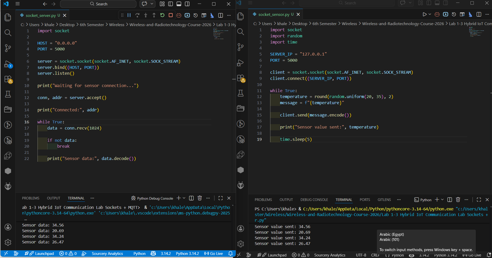
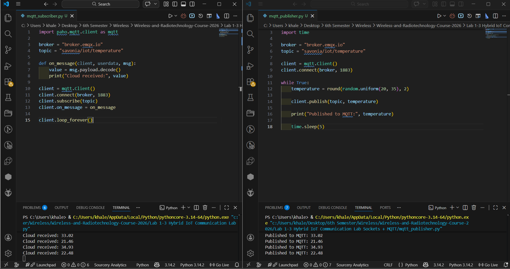
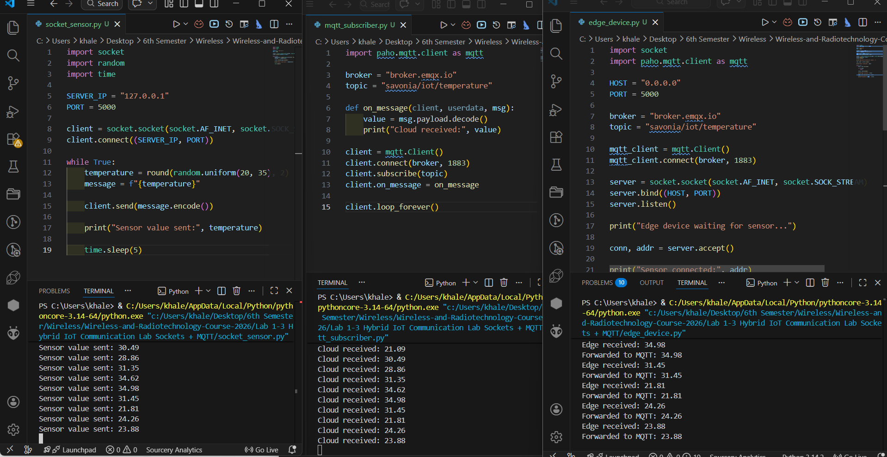

# IoT Communication Lab From Sockets to MQTT

## Overview

This project implements a simple IoT communication pipeline using Python.

The system simulates three components:
Sensor node
Edge device
Cloud server

The communication technologies used are:
Socket programming
MQTT messaging

All components were implemented on a single machine using multiple terminal windows.

---

## System Architecture

Sensor
sends data using socket
to Edge device
which forwards data using MQTT
to Cloud server

---

## IP Address Used

127.0.0.1 (localhost)

---

## MQTT Configuration

Broker
broker.emqx.io

Topic
savonia/iot/temperature

---

## Files Included

socket_server.py
socket_sensor.py
mqtt_publisher.py
mqtt_subscriber.py
edge_device.py

---

## Results
Socket Communication Screenshot  

MQTT Communication Screenshot  

Full Pipeline Screenshot  

---

## Learning Outcomes

After completing this project, the following concepts were understood:

Socket based communication between devices
MQTT publish subscribe messaging
Edge computing concept
IoT system architecture

---

## Conclusion

This project demonstrates a complete IoT data pipeline from sensor to cloud using socket communication and MQTT messaging on a single machine.
