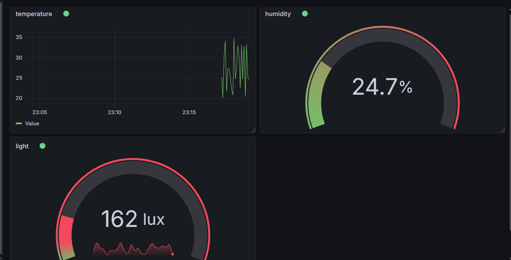

# IoT Multi-Sensor Monitoring System

## Overview
This project implements a multi-sensor IoT system that simulates environmental data and visualizes it using Grafana.

The system includes:
- A sensor node that generates simulated data (temperature, humidity, light)
- An edge device that processes and forwards data via MQTT
- A Grafana dashboard that displays real-time sensor data

---

## System Architecture

Sensor Node (socket_sensor.py)
        |
        | Socket Communication
        ↓
Edge Device (edge_device.py)
        |
        | MQTT Publish
        ↓
MQTT Broker (broker.emqx.io)
        |
        | MQTT Subscribe
        ↓
Grafana Dashboard

---

## Sensors Used

The system simulates three sensors:

1. Temperature Sensor
   - Range: 20 to 35 °C

2. Humidity Sensor
   - Range: 40% to 80%

3. Light Sensor
   - Range: 100 to 1000 lux

---

## Files Description

- socket_sensor.py  
  Simulates sensor values and sends them to the edge device using TCP socket.

- edge_device.py  
  Receives sensor data and publishes each value to a separate MQTT topic.

- README.md  
  Documentation of the project.

---

## MQTT Topics

The following MQTT topics are used:

- savonia/iot/temperature
- savonia/iot/humidity
- savonia/iot/light

Each sensor publishes its data to a separate topic.

---

## Grafana Dashboard

The dashboard consists of 4 panels:

1. Temperature Panel
   - Type: Time series
   - Displays temperature changes over time

2. Humidity Panel
   - Type: Gauge
   - Unit: Percent (0–100)

3. Light Panel
   - Type: Gauge
   - Unit: Lux (0–1000)

4. Status Panel (Optional)
   - Displays current system status or latest values

---

## Dashboard Layout

The panels are arranged as follows:

-------------------------------------
| Temperature Graph                 |
-------------------------------------
| Humidity Gauge | Light Gauge      |
-------------------------------------
| Status Panel                      |
-------------------------------------

This layout allows easy monitoring of real-time sensor data.

---

## Screenshot

Add your dashboard screenshot below:

---

## Reflection Question

### Why do we separate each sensor into a different MQTT topic?

Each sensor is published to a separate MQTT topic to keep the data organized and easy to manage. This allows different applications, such as Grafana, to subscribe only to the data they need. It also improves scalability, filtering, and flexibility in the system.

---

## Learning Outcomes

After completing this lab, the following skills were developed:

- Designing a multi-sensor IoT system
- Handling structured data streams
- Using MQTT for data communication
- Building real-time dashboards using Grafana

---