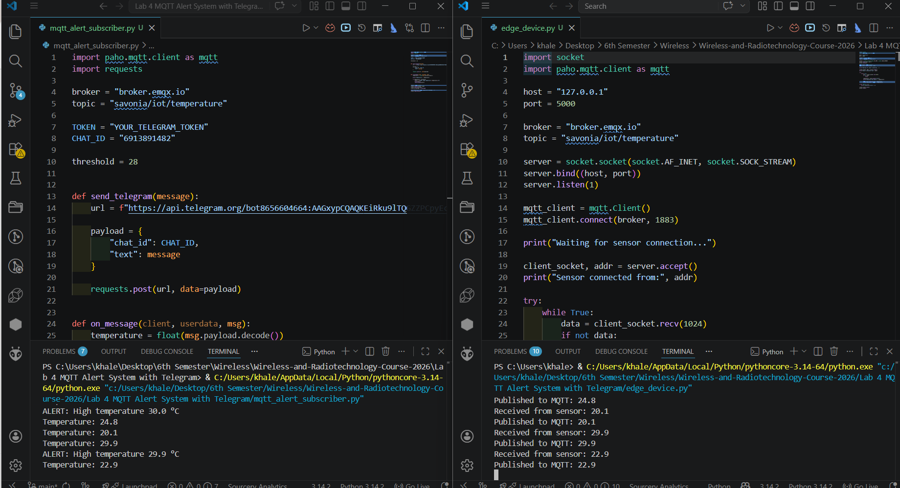
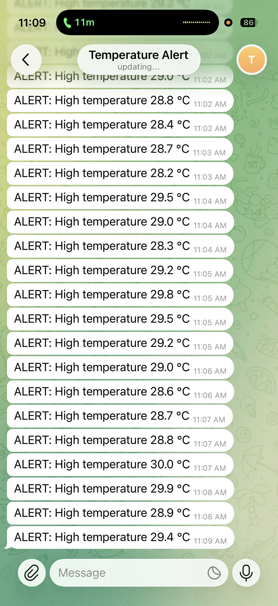

# IoT Temperature Alert System

## Description
This project implements a simple IoT monitoring system using sockets, MQTT, and Telegram alerts.

The system simulates a temperature sensor that sends data to an edge device. The edge device publishes the data to an MQTT broker, and a cloud subscriber monitors the values and sends a Telegram alert when the temperature exceeds a threshold.

## System Architecture
Sensor → Socket → Edge Device → MQTT → Cloud Subscriber → Telegram

## MQTT Topic
savonia/iot/temperature

## Files
- socket_sensor.py
- edge_device.py
- mqtt_alert_subscriber.py
- README.md

## How It Works
1. The sensor generates random temperature values every 5 seconds.
2. The edge device receives the values via socket.
3. The edge device publishes the values to the MQTT broker.
4. The subscriber receives the values.
5. If the temperature is greater than 28°C, a Telegram alert is sent.

## Screenshots

### System Output

### Telegram Alert

## Reflection

### Why is MQTT useful in IoT monitoring systems?
MQTT is useful because it is lightweight and efficient. It allows devices to communicate using a publish/subscribe model, which is ideal for real-time monitoring and alert systems. It reduces network usage and allows multiple devices to receive data easily.
