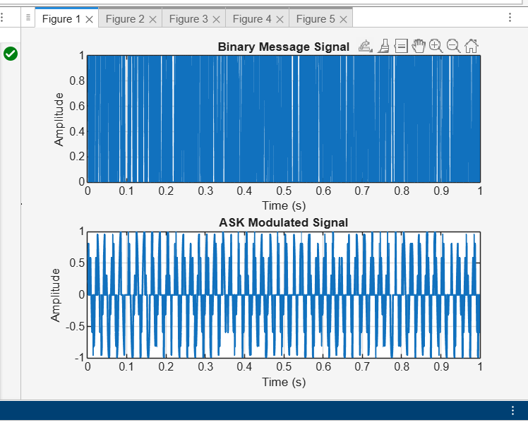
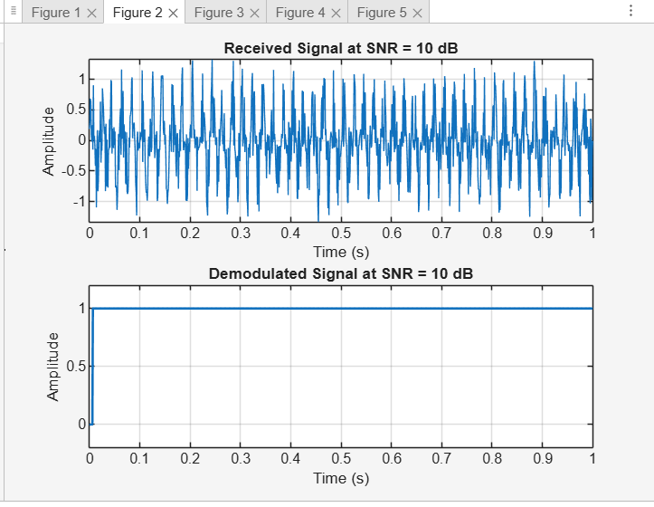
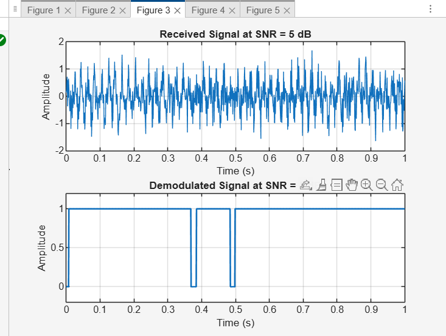
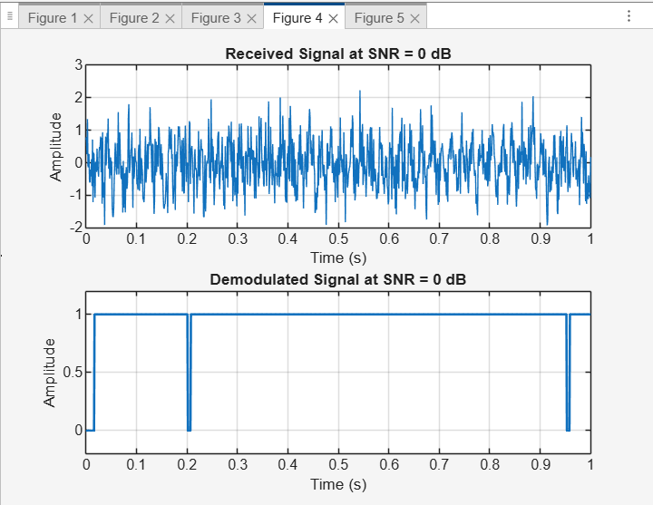
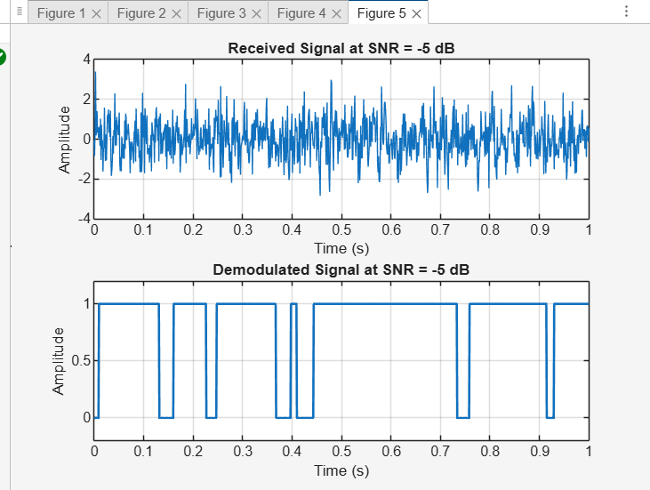

# Effect of SNR on Demodulation Performance using MATLAB

## Objective

The objective of this experiment is to study how different Signal-to-Noise Ratio (SNR) values affect the performance of a communication system during demodulation.

---

## Methodology

### 1. Binary Message Signal

A random binary signal was generated to simulate digital data transmission.

### 2. ASK Modulation

The binary signal was modulated using Amplitude Shift Keying (ASK):

* Bit 1 → carrier signal
* Bit 0 → no signal

### 3. Noise Addition

Gaussian white noise was added to the signal using different SNR values:

* 10 dB
* 5 dB
* 0 dB
* -5 dB

### 4. Demodulation

The received signal was demodulated using:

* Coherent detection
* Low-pass Butterworth filter
* Threshold detection

---

## Results and Analysis

### Message Signal and Modulation

The following figure shows the original binary message and the ASK modulated signal.

---

### SNR = 10 dB

At high SNR, the noise level is low. The received signal is clear, and the demodulated signal closely matches the original message.

---

### SNR = 5 dB

At moderate SNR, noise begins to affect the signal. The demodulated signal is still mostly correct but shows slight distortion.

---

### SNR = 0 dB

At low SNR, noise significantly distorts the signal. The demodulated signal becomes less accurate.

---

### SNR = -5 dB

At very low SNR, noise dominates the signal. The demodulated output is highly unreliable and contains many errors.

---

## Observations

* Higher SNR results in better signal quality
* Lower SNR increases noise impact
* Demodulation accuracy decreases as SNR decreases
* ASK modulation is sensitive to noise

---

## Conclusion

This experiment demonstrates that SNR has a significant impact on communication system performance. High SNR allows accurate signal recovery, while low SNR leads to distortion and errors. Maintaining a good SNR is essential for reliable communication.

---

## Files Included

* snr_demodulation_experiment.m
* README.md
* fig1.png
* fig2.png
* fig3.png
* fig4.png
* fig5.png

---

## Author

Khaled Ahmed
