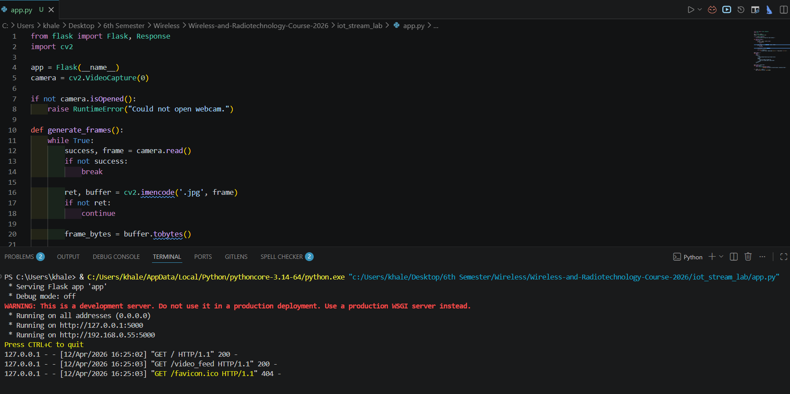
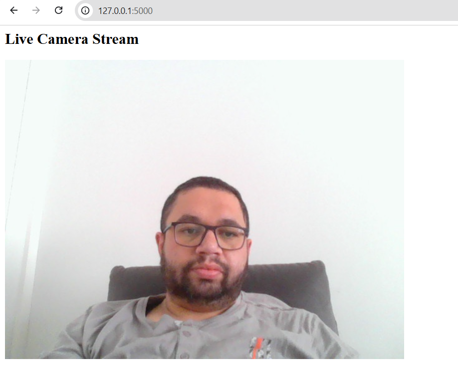

Lab 2 – Real-Time Home Monitoring Stream

Student Name: Khaled Ahmed

System Description:
This lab implements a simple real-time home monitoring system using Python, OpenCV, and Flask. The system captures live video from a webcam and streams it over the local network so another device can view it in a web browser.

Roles:
Laptop A (Camera / Sender): Khaled Ahmed
Laptop B (Viewer / Receiver): Tested locally on the same device

Sender IP Address:
127.0.0.1 for local testing
192.168.0.55 for network access

How the Stream Was Started:
1. Python packages were installed:
   - opencv-python
   - flask
2. The program was started using:
   py app.py
3. Flask started the web server on port 5000.
4. The live stream was opened in a browser using:
   http://127.0.0.1:5000

System Status:
The system worked successfully.

- The webcam stream started correctly.
- The browser was able to open the stream.
- The video updated continuously in real time.
- The system behaved like a simple home monitoring camera.

Problems and Fixes:
- Issue: Python command was not working directly.
  Fix: Used `py` instead of `python`.

- Issue: Flask showed a PATH warning during installation.
  Fix: No action was needed because the project runs correctly with `py`.

Screenshots:

Flask Server Running on Laptop A:

Browser Stream Open:
