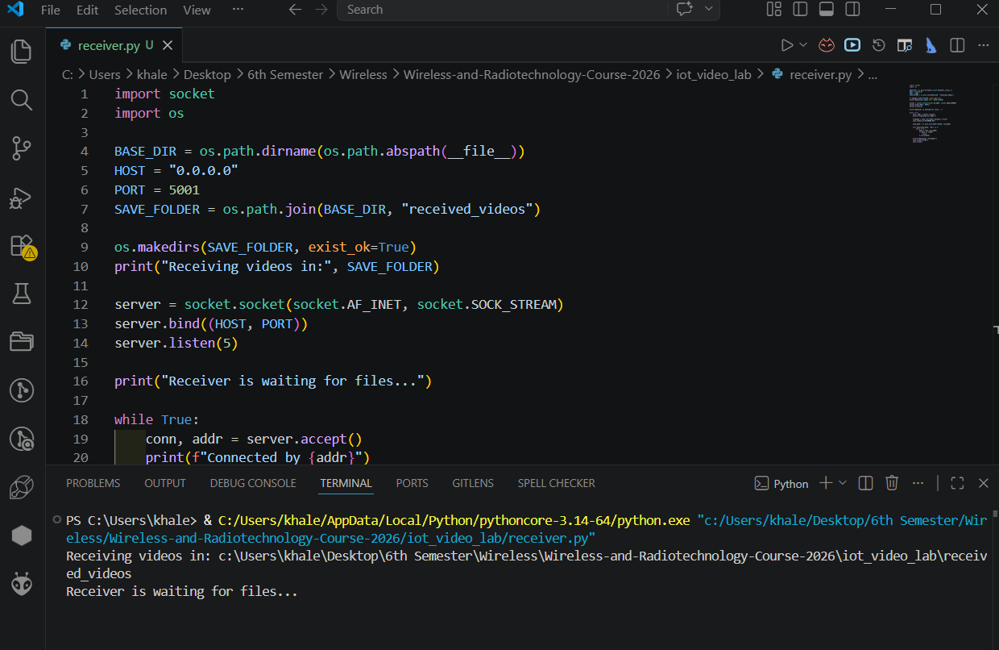
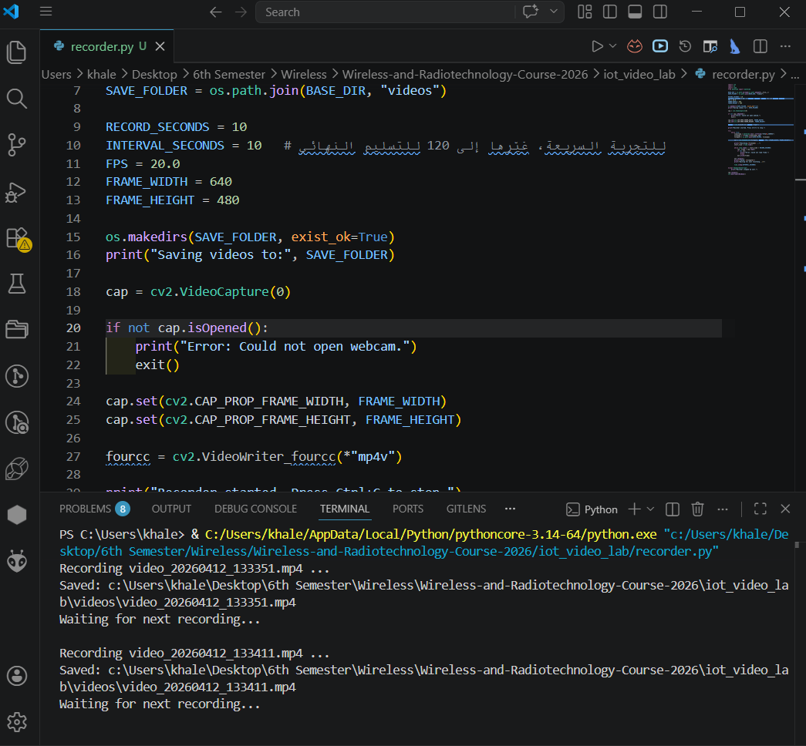
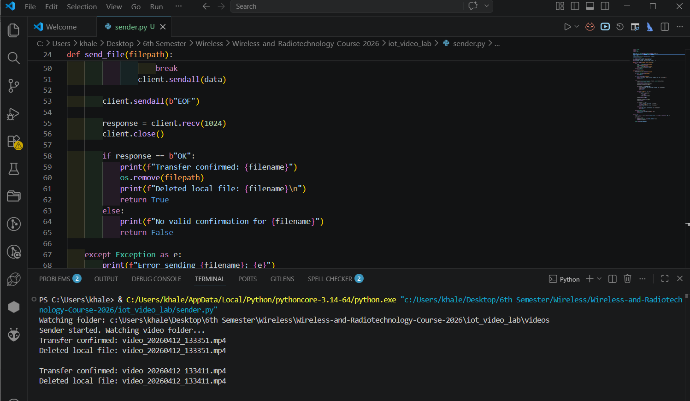
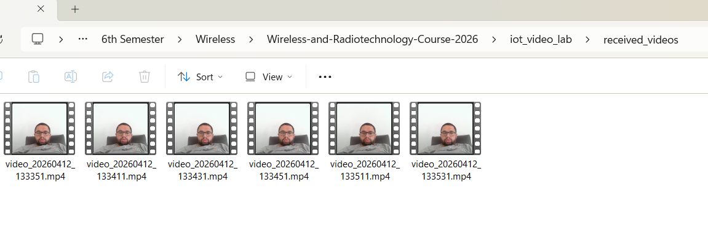
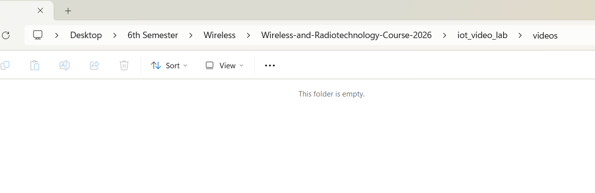

Lab 1 – Periodic Video Capture & Automated Data Transfer

Student Name: Khaled Ahmed

System Description:
This project implements a simple IoT pipeline that records video periodically, sends it to another device, and deletes the local copy after successful transfer.

Roles:
Laptop A (Sender + Recorder): Khaled Ahmed
Laptop B (Receiver): Tested locally using same device (127.0.0.1)

Receiver IP Address:
127.0.0.1

How the System Works:
1. The recorder captures a 10-second video every interval.
2. The video is saved locally in the "videos" folder.
3. The sender detects new video files.
4. The sender sends the video to the receiver over TCP.
5. The receiver saves the file in "received_videos".
6. The receiver sends confirmation (OK).
7. The sender deletes the local file after confirmation.

System Status:
The system worked successfully.

- Videos were recorded automatically.
- Videos were transferred automatically.
- The receiver stored the videos correctly.
- The sender deleted the videos only after receiving confirmation.

Problems and Fixes:
- Issue: Files were not appearing in the correct folder.
  Fix: Used absolute paths based on script location.

- Issue: Sender tried to send files while recording.
  Fix: Added file readiness check before sending.

Screenshots:

Receiver Running:

Recorder Running:

Sender Transfer:

Received Video:

Sender Deleted File:
