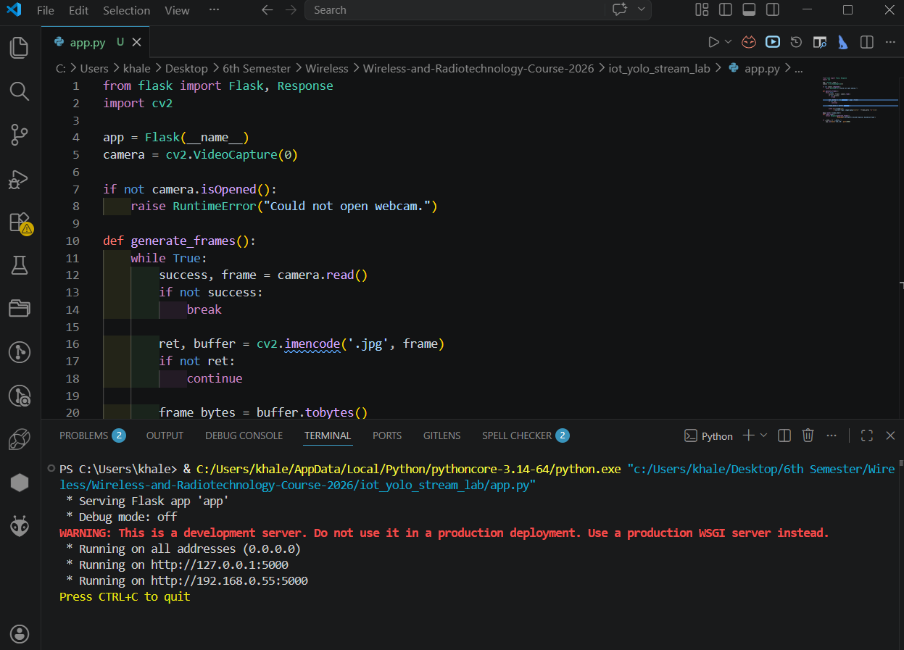
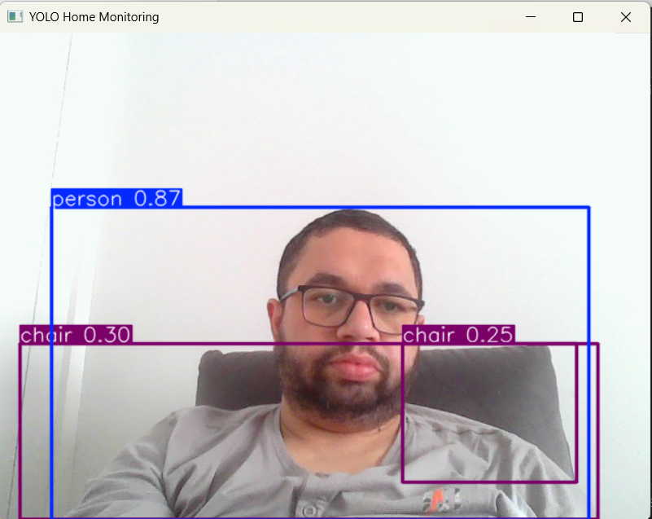

Lab 3 – Intelligent Home Monitoring with YOLO

Student Name: Khaled Ahmed

System Description:
This lab implements a simple intelligent home monitoring system using real-time video streaming and YOLO object detection. The system captures video from a webcam, streams it over the network, and processes it using AI to detect objects in real time.

Roles:
Laptop A (Camera / Sender): Khaled Ahmed
Laptop B (AI Node / Receiver): Tested locally on the same device

Sender IP Address:
127.0.0.1 for local testing
192.168.0.55 for network testing

How the Stream Was Started:
1. The video stream was started using Flask:
   py app.py
2. The stream URL:
   http://127.0.0.1:5000/video_feed

How YOLO Was Run:
1. YOLOv8 model was loaded using ultralytics:
   yolov8n.pt
2. The detection script was started:
   py yolo_stream.py
3. The system processed each frame in real time and displayed results.

System Results:
The system worked successfully.

- The webcam streamed video correctly.
- The YOLO model processed the incoming frames.
- Objects such as persons and objects in the room were detected.
- Bounding boxes and labels were displayed correctly.

Detected Objects:
Examples of detected objects include:
- person
- chair

Screenshots:

Flask Stream Running:

YOLO Detection Output:
